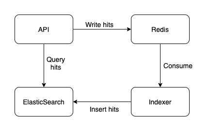

## Redis and ElasticSearch with Go

This project shows an example how to design a system.

```text
Below is the system description:

Design a system to keep track the number of hits for events.
An event is identified by a unique ID of type string. 

The system should provide two APIs:
1. Track an hit for an event.
2. Retrieve an event's hit counts for the last 5 minutes, 1 hour, 1 day, 2 days and 3 days.
```

Refer to [endpoints documentations](#endpoints) for more information.

## System Design

In this section, we will explain how the system is designed.

We make some assumptions and estimations about the system.
- The system is very write heavy, with the read-to-write ratio of 1:100.
- A few minutes of write-to-read delay is acceptable.
- The system must be be to handle at least 10,000 hit events per second.
- The Track API must be very fast, the expected 90th latency must be below 100ms.

### Functional Requirements
- The system has to track hits for an Event ID.
   
- The system has to return hit counts for an Event ID.

### Non-Functional Requirements
- Scalable: the system should handle high throughput i.e. thousands of hit events per seconds. It should also handle spiky traffic.
- Availability: the system should be fault tolerance. It's acceptable if the data returned is stale.
- Eventual Consistency: we choose eventual consistency since the data does not require strong consistency, and some delay is acceptable.
- 

### Data Model
We can either store individual events or aggregate events in real time.

We choose to store individual events since it's the simplest solution, and more flexible. 
The trade off is reads may be slow, and it will consume more storage.

Below is the event model:
```json
{
  "id": "string",
  "timestamp": "string"
}
```

The query that will be performed is an aggregation based on time ranges.

### High Level Details
Based on the information above, below is the system design details:

- We use ElasticSearch to store the hit events.
ElasticSearch has high scalability built in and support complex aggregation queries based on time range.
- Message queue is implemented using Redis. Protobuf is used as to serialize. 
- The API server will receive the HTTP requests and insert the hit events into the message queue. 
- The Indexer will consumed the hits events (in batches) and index them into ElasticSearch (using Bulk insert).

<p align="left">
	
</p>

## Endpoints

#### Track - POST /analytics

Track a hit for an event.

Request
```json
{
  "id": "id"
}
```
Response
```text
No Content
```

#### Retrieve - GET /analytics/{id}

Retrieve hits counts for an event.

Response
```text
{
  "id": "1",
  "counts": [
    {
      "reference": "3 days ago",
      "count": 3
    },
    {
      "reference": "2 days ago",
      "count": 3
    },
    {
      "reference": "1 day ago",
      "count": 3
    },
    {
      "reference": "1 hour ago",
      "count": 1
    },
    {
      "reference": "5 minutes ago",
      "count": 1
    }
  ]
}
```

## How to run

Prerequisites:
- Docker Compose 3.7+
- Docker Engine 18.06.0+

```bash
# build the docker image
[terminal 1] bash scripts/build.docker.s h

# run docker compose
[terminal 1] docker-compose up --build
```

Assuming default configurations, following are the available endpoints:
- Track API: POST http://localhost:8001/analytics
- Retrieve API: GET http://localhost:8001/analytics
- ElasticSearch: http://localhost:9200
- Kibana: http://localhost:6379

To clean up, you can do:
```bash
[terminal 1] docker-compose down -v
```

### Using Makefile

To simplify things, you can use the Makefile.

Build the docker image and run the docker compose.
```bash
[terminal 1] make run-docker
```

Stop and clean up the docker compose.
```bash
[terminal 1] make clean-docker
```


### Running all the tests

Prerequisites:
- Docker Compose 3.7+
- Docker Engine 18.06.0+

Some of the tests require ElasticSearch server. It's expected that the server is reachable at `http://127.0.0.1:9200/`

To make it easy, there's provided script that will start the ElasticSearch server in a Docker container and run the tests.
```bash
[terminal 1] bash run.tests.sh
```

## Benchmark Tool

You can spam Track request using benchmark tool in `cmd/benchmark` directory.

The tool will spam Track requests as fast as possible, using a number of workers.

The default number of workers is 1, and you set it using `-w` flag or env.

The default Event ID is `1`, and you can set it using `-i` flag or env.

```bash
go run cmd/benchmark/main.go -w 1 -i eventid
```